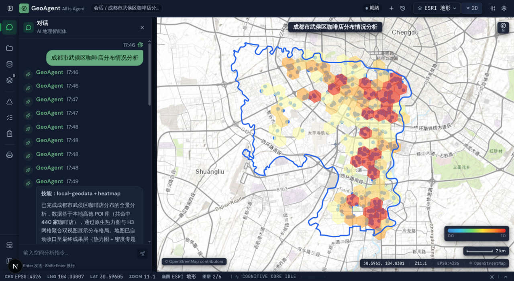
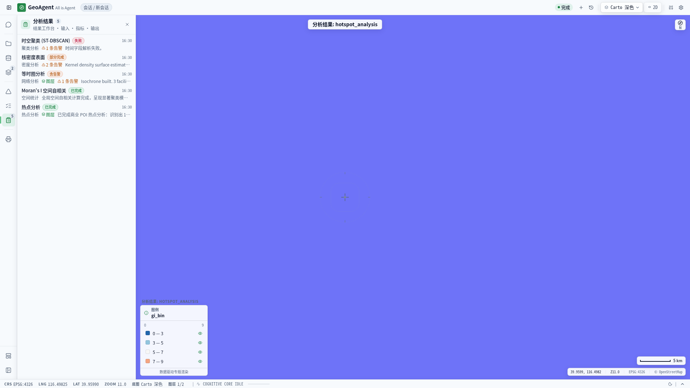

# WebGIS AI Agent

**用自然语言完成空间分析、遥感计算与专业制图的 AI GIS 工作台。**

WebGIS AI Agent 将 LLM Agent 与真实 GIS 计算栈(FastAPI + Celery + PostGIS + rasterio)结合:
你用中文或英文描述任务("分析北京学校分布并出一张专题图"),Agent 规划工具调用链,
在后端执行真实的地理计算,并通过 SSE 流式把图层、进度与结果推回地图工作台。

<p align="center">
  <a href="https://github.com/WindWang2/webgis-ai-agent/actions/workflows/production.yml"></a>
  <a href="https://github.com/WindWang2/webgis-ai-agent"></a>
  <a href="https://github.com/WindWang2/webgis-ai-agent"></a>
  <a href="https://github.com/WindWang2/webgis-ai-agent"></a>
  <a href="https://github.com/WindWang2/webgis-ai-agent"></a>
</p>

<p align="center">
  <em>结果工作台:深色主题</em><br>
  
</p>
<p align="center">
  <em>结果工作台:浅色主题</em><br>
  
</p>

## 目录

- [✨ 功能特性](#features)
- [🏗️ 架构概览](#architecture)
- [📁 目录结构](#structure)
- [🚀 快速开始](#quickstart)
- [⚙️ 环境变量配置](#configuration)
- [🧪 测试与质量门禁](#testing)
- [📦 部署](#deployment)
- [📖 文档索引](#docs)
- [🗺️ 路线图](#roadmap)
- [🤝 贡献指南](#contributing)
- [📄 许可证](#license)

<a id="features"></a>

## ✨ 功能特性

**对话式空间分析**
- 34 组注册工具 + 动态技能脚本:地理编码、OSM 检索、缓冲/叠加/空间连接等矢量算子、
  H3 六边形聚合、LISA 空间自相关、地形与分区统计
- 网络分析引擎:最近设施(top-K)、等时圈、路径规划、VRP 路线优化(O(1) 2-opt 增量,320 站点亚秒级)
- 遥感分析:rasterio 集成,NDVI/EVI 等指数计算、时序变化检测、尊重 nodata 的栅格统计

**数据获取**
- 空间探索引擎 Explorer:意图识别 → 数据发现 → 抓取 → 解析 → 验证 → 地理编码的完整流水线
- Data Fabric 数据织网:外部数据源目录、断路器保护、物化缓存
- 中文地图源适配:天地图 / 高德 / 百度(POI、路径、地理编码)
- 数据上传:Shapefile 等矢量数据按会话作用域管理

**专业制图(MapSpec 闭环)**
- AI 生成制图规范,前端 Canvas 合成专题图:指北针、比例尺、图例自动适配
- WYSIWYG 导出遮罩,A4/屏幕画幅,最高 300 DPI,PNG / PDF 输出
- 制图模板库与 L1–L5 分级的制图质量闭环([docs/cartographic-closed-loop.md](docs/cartographic-closed-loop.md))

**大数据渲染契约**
- Fetch-on-Demand:超大 FeatureCollection 不进 LLM 上下文,以 `ref:` 提货券流转,前端按需拉取
- MVT 矢量瓦片:>5000 要素图层自动切瓦片,MapLibre 凭据注入加载([docs/data-fetcher.md](docs/data-fetcher.md))

**工程化**
- 统一 durable job 运行时:任务状态落库、跨重启、真取消、幂等重试,前端任务中心统一查看
- 项目工作区:项目 / 数据集 / 工作流 / 产物与血缘
- 知识库 RAG:sentence-transformers + FAISS,文档分块检索增强
- 安全:JWT 认证 + 匿名会话 `owner_token` 隔离、登录限流、SSRF 校验、bandit 扫描
- 可观测:Prometheus 指标、Grafana 仪表板、结构化日志(structlog)
- 专业 GIS 工作台 UI(Visual System V4):明暗双主题、语义 token 体系、对比度测试守护
- StoryMap 叙事回放:把会话过程重放为地图故事页

<a id="architecture"></a>

## 🏗️ 架构概览

```
┌─────────────────────────────────────────────────────────────┐
│  前端工作台  Next.js 14 + MapLibre GL + Zustand               │
│  NavRail + ContextPanel 外壳 · SSE 流解析 · MapSpec 合成      │
└──────────────┬──────────────────────────────▲────────────────┘
       POST /api/v1/chat/stream               │ SSE(结果/进度/心跳)
       + map_state 感官回传                    │ WebSocket
┌──────────────▼──────────────────────────────┴────────────────┐
│  API 网关  FastAPI(非阻塞路由 + 限流 + JWT)                  │
│  ChatEngine:规划 → 工具调用 → 观察 → 反思循环                  │
│  (可选 Pi agent 桥:USE_NEW_AGENT,JSON-RPC 子进程)           │
└──────┬──────────────────────────────────────────┬────────────┘
       │ Celery broker(Redis)                     │ 状态/会话数据(Redis)
┌──────▼──────────────────────┐          ┌────────▼────────────┐
│  Celery Workers             │          │  Redis               │
│  GeoPandas / rasterio /     │          │  broker + backend    │
│  网络分析 / 制图分类          │          │  + SessionDataManager│
└──────┬──────────────────────┘          └─────────────────────┘
       │
┌──────▼───────────────────────────────────────────────────────┐
│  存储  PostgreSQL / PostGIS(生产) · SQLite(开发兜底)         │
│  Alembic 迁移链 · 22 张表 · durable job 事实源                 │
└──────────────────────────────────────────────────────────────┘
```

| 层 | 技术选型 | 说明 |
|---|---|---|
| 前端 | Next.js 14 · React 18 · MapLibre GL · Zustand · Tailwind | App Router,双 tsconfig 严格类型 |
| 网关 | FastAPI · uvicorn · PyJWT · prometheus-instrumentator | 全路由挂 `/api/v1`,SSE 流式 |
| Agent | OpenAI 兼容 LLM 客户端(httpx)· ChatEngine · Pi agent 桥 | 默认阶跃 Step Plan,支持推理模型与流式 tool-call |
| 计算 | Celery · Redis · GeoPandas · rasterio · scikit-learn | 重算力全部出离事件循环 |
| 存储 | SQLAlchemy 2 · Alembic · PostGIS / SQLite | 单迁移链,漂移由 CI 测试守护 |

深度架构文档:[docs/architecture.md](docs/architecture.md) · 技术方案:[docs/技术方案说明书.md](docs/技术方案说明书.md)

<a id="structure"></a>

## 📁 目录结构

```
├── app/                     # FastAPI 后端
│   ├── api/routes/          # REST / SSE / WS 路由(auth、chat、explorer、jobs、layers…)
│   ├── core/                # 配置、安全、限流、数据库
│   ├── models/              # SQLAlchemy ORM(22 张表)
│   ├── schemas/             # Pydantic 模型
│   ├── services/            # ChatEngine / Explorer / Data Fabric / Jobs / RAG / MapSpec
│   ├── tasks/               # Celery 任务(explorer 任务链等)
│   ├── tools/               # LLM 工具武库(空间分析 / 遥感 / 制图 / 中文地图源…)
│   └── main.py              # FastAPI 应用入口
├── frontend/                # Next.js 14 工作台(详见 frontend/README.md)
│   ├── app/                 # 主工作台 + /story StoryMap 页
│   ├── components/          # chat / map / hud / sidebar / explorer / report / settings
│   ├── lib/                 # Zustand store · map-kit · SSE 解析 · MapSpec 编译器
│   └── test/                # vitest + 设计系统契约测试 + 视觉回归
├── migrations/              # Alembic 迁移链(18 个 revision)
├── deploy/                  # nginx / k8s kustomize / redis / prometheus / grafana
├── docs/                    # 文档与 ADR(54 篇决策记录)
├── tests/                   # pytest:根回归 + unit + jobs + cartography + perf + benchmarks
├── manage.py                # 开发运维 CLI(dev / server / worker / check / init-db / create-admin)
├── docker-compose.yml       # 开发栈(db / redis / api / celery)
├── docker-compose.prod.yml  # 生产栈(+ nginx / prometheus / grafana / exporters)
└── Dockerfile / Dockerfile.prod
```

<a id="quickstart"></a>

## 🚀 快速开始

### 环境要求

- Python ≥ 3.12,Node ≥ 22
- Redis(本地 16379 或 Docker 起)
- LLM API Key(默认对接阶跃 Step Plan,任何 OpenAI 兼容端点均可)

### 方式一:Docker Compose 起后端(推荐)

```bash
git clone https://github.com/WindWang2/webgis-ai-agent.git
cd webgis-ai-agent

cp .env.example .env
# 编辑 .env,至少设置:
#   REDIS_PASSWORD=<任意密码>     # compose 强制要求
#   DB_PASSWORD=<任意密码>        # compose 强制要求
#   LLM_API_KEY=<你的密钥>

docker compose up -d --build   # 起 db + redis + api + celery-worker
```

后端就绪于 `http://localhost:18000`(交互式 OpenAPI 文档:`/docs`)。
开发栈不含前端服务,另开终端:

```bash
cd frontend
pnpm install
# 编辑 .env.local,把后端地址指向 compose 暴露的 18000:
#   NEXT_PUBLIC_API_URL=http://localhost:18000
#   NEXT_PUBLIC_WS_URL=ws://localhost:18000
npm run dev                    # http://localhost:3000
```

### 方式二:全本地开发(manage.py)

```bash
# 前置:本机 Redis 可达(默认 redis://localhost:16379,可在 .env 覆盖 REDIS_URL)
# 若无本地 Redis,可只用 compose 起基础设施:
#   docker compose up -d db redis

pip install -r requirements.txt
cp .env.example .env           # 填入 LLM_API_KEY 等

python manage.py check         # 诊断 DB / Redis / LLM / Celery 连通性
python manage.py dev           # 一键拉起 后端:18000 + Celery worker + 前端:3000
```

`manage.py` 完整命令参考见 [docs/SETUP_INSTRUCTIONS.md](docs/SETUP_INSTRUCTIONS.md)。

### 演示模式(无需后端)

启动前端后在左下角点击 **Try Demo**,可离线体验完整的 Agent 交互流程。

<a id="configuration"></a>

## ⚙️ 环境变量配置

完整清单见 [.env.example](.env.example),关键项:

| 变量 | 必填 | 说明 |
|---|---|---|
| `LLM_API_KEY` | ✅ | LLM 密钥;生产模式拒绝占位符 |
| `LLM_BASE_URL` | 建议 | OpenAI 兼容端点,默认阶跃 Step Plan |
| `LLM_MODEL` | 否 | 默认 `step-3.7-flash`;`LLM_PLANNER_MODEL` 可为规划单独配模型 |
| `JWT_SECRET_KEY` | 生产必填 | JWT 签名密钥;dev 缺省自动生成随机密钥并警告 |
| `DATABASE_URL` | 否 | 默认 SQLite(`sqlite:///./data/webgis.db`);生产用 PostGIS |
| `REDIS_URL` / `CELERY_BROKER_URL` / `CELERY_RESULT_BACKEND` | 否 | 默认 `redis://localhost:16379` 的 db0/db1 |
| `TIANDITU_TOKEN` / `AMAP_API_KEY` / `BAIDU_MAP_AK` | 按需 | 中文底图与 POI 服务密钥 |
| `SENTINELHUB_*` / `NASA_EARTHDATA_*` / `OPENTOPOGRAPHY_API_KEY` | 按需 | 遥感数据源凭据 |

生产/安全栈另有 `.env.prod.example` 与 `.env.Priv.example` 两套模板,详见[部署文档](docs/DEPLOYMENT.md)。

<a id="testing"></a>

## 🧪 测试与质量门禁

本地与 CI 同构 —— 推送前跑一条命令，就是 PR lane 的同一批门禁(#671):

```bash
scripts/ci-local.sh          # 全量:lint + typecheck + vitest + 后端/perf/cartography pytest
scripts/ci-local.sh --fast   # 快速:ruff + eslint + typecheck + vitest
```

脚本命令与 [`production.yml`](.github/workflows/production.yml) 逐字对齐,漂移由
`tests/test_ci_local_gate_contract.py` 契约断言守住。日常快速回路仍可用:

```bash
# 后端
pytest -q tests/unit tests/integration     # 日常快速回路
ruff check app/ tests/ main.py manage.py   # lint(仓级,与 CI 同)

# 前端(vitest 覆盖率闸 75/70/75/60)
cd frontend
npx vitest run
npm run typecheck && npm run lint
npx next build                             # 构建是页面导出的最终门禁
```

CI([`.github/workflows/production.yml`](.github/workflows/production.yml))PR 必须全绿合并的 9 项门禁:

| 门禁 | 内容 |
|---|---|
| Code Quality | ruff + ESLint(0 warning) |
| Backend Tests | PostGIS + Redis service 容器,`--cov-fail-under=75` |
| Frontend Tests | vitest + 双 tsconfig typecheck + next build |
| Security Scan | bandit(`-ll -ii` 阻塞)+ 依赖 CVE 审计(非阻塞) |
| Performance Gate | perf 基线锚定,回归即失败 |
| Cartography Gate | 制图闭环确定性冒烟(release-blocking) |
| Deploy Config Gate | `nginx -t` 校验生产 nginx 配置 |
| DB Migration Gate | PostGIS 上全量 alembic 链 + 模型↔迁移漂移比对 |
| Real Services Smoke | 真实 Celery worker + Redis + PostGIS 冒烟 |

另有 nightly lane:Playwright 运行时校验器与 cartography/perf 全量矩阵。运行时场景的写法见 [Runtime Scenario 作者指南](docs/runtime-scenario-guide.md)。

<a id="deployment"></a>

## 📦 部署

| 形态 | 文件 | 适用场景 |
|---|---|---|
| 开发栈 | `docker-compose.yml` | 本地开发(db/redis/api/celery) |
| 生产栈 | `docker-compose.prod.yml` | 单机生产,含 nginx + Prometheus + Grafana + exporters(10 服务) |
| 安全栈 | `docker-compose.prod.secure.yml` | 公网远程部署:db/redis 不暴露端口,CI preview/deploy/rollback 实际使用 |
| Kubernetes | `deploy/k8s/`(kustomize) | 云上伸缩,initContainer 自动迁移,HPA/PDB |

CI 在 release-gate 通过后自动构建镜像推送 `ghcr.io`,并支持 PR 预览、生产部署与一键回滚。
完整手册:[docs/DEPLOYMENT.md](docs/DEPLOYMENT.md)。

<a id="docs"></a>

## 📖 文档索引

| 文档 | 内容 |
|---|---|
| [技术方案说明书](docs/技术方案说明书.md) | 顶层方案:概念域、能力矩阵、演进路线 |
| [架构文档](docs/architecture.md) | 分层架构、核心链路、扩展纪律 |
| [API 文档](docs/api-docs.md) | REST / SSE / WS 契约与事件目录 |
| [数据库设计](docs/database-design.md) | 22 张表、Redis 键布局、迁移链 |
| [部署手册](docs/DEPLOYMENT.md) | 四种部署形态、CI/CD、监控与运维 |
| [本地开发手册](docs/SETUP_INSTRUCTIONS.md) | 环境搭建、启动路径、排错 |
| [Fetch-on-Demand](docs/data-fetcher.md) | 大数据提货券机制与 MVT 瓦片 |
| [制图闭环规范](docs/cartographic-closed-loop.md) | L1–L5 制图质量分级与评审 |
| [限流规范](docs/rate-limiting.md) | 限流架构与阈值 |
| [前端文档](frontend/README.md) | Visual System V4 设计系统与组件架构 |
| [工程纪律](CODE_REVIEW.md) | 代码红线与历史缺陷修补录 |
| [变更日志](CHANGELOG.md) | 逐版本变更记录 |
| [ADR](docs/adr/) | 54 篇架构决策记录 |

<a id="roadmap"></a>

## 🗺️ 路线图

- ✅ **Phase 1–2** — 核心链路打通:对话 → 工具 → 图层上图;Celery 计算隔离
- ✅ **Phase 3–4** — 专业制图(MapSpec)、遥感分析、模板库、技能自进化
- ✅ **Phase 5** — 安全硬化(认证/隔离/限流)、V4 工作台 UI、durable job 运行时、
  MVT 大数据契约;2026-08 质量加固波次(52 项开放 issue 根因清零,PR #566–#576)
- 🚧 **Phase 6** — 用户认证增强与动态栅格图层(规划中)

<a id="contributing"></a>

## 🤝 贡献指南

1. Fork 并从 `master` 拉特性分支;PR 需通过上表全部 9 项门禁
2. 遵守[工程纪律](CODE_REVIEW.md)四条红线:
   - **Pydantic Type Guard**:工具参数用最严格的 `pydantic.Field` 约束
   - **Zero Big Data in Context**:禁止把 FeatureCollection 塞进 LLM 上下文,一律走 `ref:` 提货券
   - **Celery First**:`gpd.sjoin` / `rasterio.open` / `pd.read_csv` 级别的计算必须进 Celery worker
   - **No Raster Push**:后端不生图片,交付源数据 + `metadata.color_ramp`,渲染交给 MapLibre
3. 新增空间算子前先读 [docs/architecture.md](docs/architecture.md) 的扩展纪律一节
4. 架构级变更请先提交 ADR(模板见 `docs/adr/`)

<a id="license"></a>

## 📄 许可证

[MIT](LICENSE)
