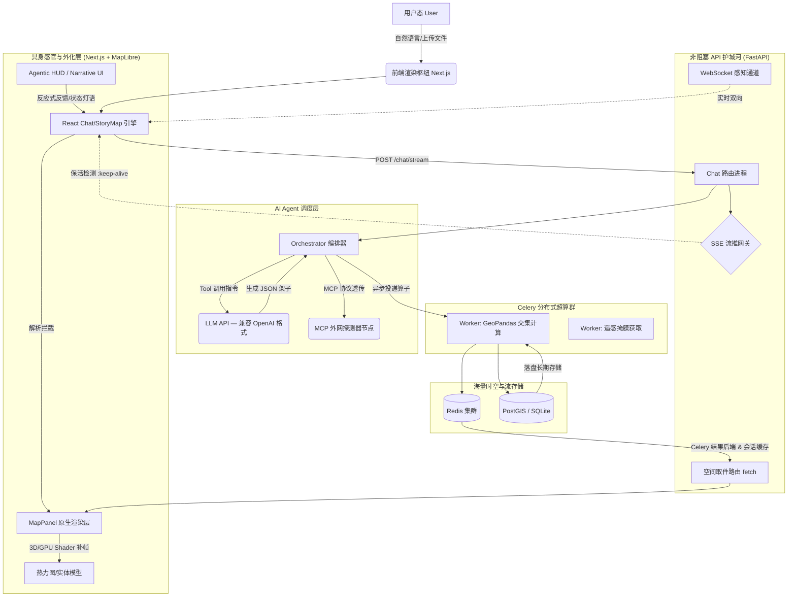

# WebGIS AI Agent 技术架构设计文档 (V3.3)
> 版本：v3.3 | 日期：2026-04 | 状态：最终稳定版

## 1. 架构概述与设计原则：一切皆 Agent (Everything is Agent)
本项目不仅是 WebGIS 工具，而是一个**主权级空间智能体 (Sovereign Spatial Agent)**。我们遵循“Agent 即系统”的哲学：
-   **中枢神经系统 (Agent CNS)**：AI 不再是外部插件，而是系统的逻辑核心。它拥有对数据、渲染和交互的绝对主权。
-   **具身感知 (Embodied Perception)**：前端 MapLibre 实例是 Agent 的感官延伸。通过实时状态回传（Map State Sync），Agent 能“感知”用户正在看的分辨率、范围和活跃图层。
-   **思维外化 (Externalized Thought)**：UI 的每一次变化、图层的每一次叠加，都是 Agent 思维过程的实体化。
-   **极致的计算隔离**：FastAPI 只负责神经信号传输，Celery Worker 是 Agent 强大的“肌肉”，负责处理 GeoPandas 裁剪、遥感影像掩膜等高密计算。
-   **数据主权存储 (Data Sovereignty)**：大数据传输通过 `ref_id` 提货券流转，确保 Agent 内存（上下文）只保留本质的逻辑关联。
-   **防旁路纪律 (Anti-Bypass Discipline)**：严禁绕过 Agent 的端点或交互逻辑。即使是传统的文件上传或地图操作，也必须通过“感知-上报”机制同步给 Agent，确保 Agent 是系统中唯一的真理来源。

---

## 2. 整体立体分层流转架构



---

## 3. 核心流链路解析

### 3.1 Fetch-on-Demand (按需提件流)
在传统的 LLM+GIS 应用中，由于大模型需要输出计算结果，常常会导致上下文被 50MB 的 GeoJSON 所撑爆。
**V2.0 解决方案**：
1. **Tool 层封箱**：当后端 Python 函数运行完毕获得大尺寸 `FeatureCollection` 时，生成一个唯一随机签名，如 `ref_id: ref:geojson-a1b2c3d4`。数据本体被存入内存 `SessionDataManager`（LRU 淘汰策略，每 session 最多 200 条）。
2. **LLM 传输层**：大模型仅看到 `{"layer_id": "geojson_09a8b7c", "render_type": "heatmap"}` 这样的虚壳签名，立刻返回给主路由。
3. **SSE 极简下发**：网关实时推送提货码，前端 HUD 同步展示任务进度。
4. **前端提货**：客户端 React 拦截器拼装出 `layer_id` 后，通过 `/api/v1/layer/{id}/data` 发起独立的 HTTP 拉取任务。
5. **挂载**：获取的巨量点位直接绕过 React State，注入 `mapRef` 实例底层源生绘制。

### 3.2 SSE Keep-Alive 心跳保活阵列
在进行动辄数分钟的全国级道路网相交测算时，前端与 FastAPI 极易因为长时间无响应而发生 `ERR_CONNECTION_RESET`。
**V2.0 解决方案**：
在 `chat_engine.py` 的主异步生成器中，植入了一组独立看门狗循环。当测算被丢给 Celery 且进入阻塞等待时，看门狗每隔 15 秒向传输层丢弃一个透明的注释型数据框（如 `data: [HEARTBEAT]\n\n` 或空字段）。此机制从硬件网关（Nginx等）层面维系了通道常开。

3.3 Map State & Sensory Integration (感官与状态同步)
为了实现“一切皆 Agent”，我们构建了双向的感官反馈闭环：
1. **主动感知 (Proactive Perception)**：
   - 每一次聊天请求发起时，前端会自动采集当前的 `viewport`（中心点、Zoom）和 `layers`（显隐状态、透明度）。
   - 这些数据作为 `map_state` 发送至后端，并持久化到 `SessionDataManager`。
2. **实时 HUD 注入与双源算法**：
   - `ChatEngine` 会将上述数据转化为 `[当前地图状态 (实时感知)]` 块，作为系统观测注入 AI 的 Context。
   - **双源感知策略 (Strategy 2)**：当后端 Session 数据过期或重置时，Agent 会回退到前端实时上报的图层 ID 进行“具身感知”。这种自愈能力允许 Agent 控制由于页面刷新或 Session 过期遗留的“客场图层”，实现跨 Session 的操控主权。
3. **闭环稳定性**：AI 被约束在单轮交互中通过“执行-观察-感知”完成逻辑缝合，极大减少了由于视角不匹配导致的盲目重复调用。

### 3.4 MCP 外接超脑与破网抓取 (Sub-Agent)
系统通过 Model Context Protocol 实现了标准化插件生态。
1. **破网爬行者 (Crawler)**：在 Tool 层嵌入 `duckduckgo-search` 组件。当 AI 在本地数据库寻址失败时，隐秘释放探测器向外网请求当前地理百科或新闻流。
2. **ZHIPU 远端阅读器**：通过对接 Z_AI 的 MCP Server (`web-search-prime`, `web-reader`)，将网络非结构化报文送发远端清洗并提纯中心坐标返回给主脑。

### 3.4 Operational Stability & State Resilience (操作稳定性与状态自愈)
为了确保 Agent 在复杂的网络和浏览器环境下依然稳健，引入了以下硬化指标：
1. **Hydration Integrity (水合完整性)**：React 界面中，我们将 `ReactMarkdown` 的段落标签 (`p`) 语义化映射为除块级元素之外的 `div`，彻底杜绝了由于内容嵌套非法（如 `div` 嵌套在 `p` 中）导致的前端 Hydration 警告。
2. **Image Safety Guards (图片渲染护城河)**：通过自定义渲染器强制过滤非法的或由模型幻觉产生的图片地址。仅允许合规的 `http(s)` 或 `data:` 协议，且阻断任何非预期的本地占位符（如 ``），有效消灭了控制台中的 404 资源错误。
3. **Sequence-Guaranteed Persistence (序贯持久化)**：后端 `Message` 的数据库写入由“异步 background”改为“同步 await”。这确保了 auto-increment ID 严格遵循对话的时间轴，彻底解决了并发写入可能导致的会话历史重构混乱（Context Corruption）问题。

### 3.5 Agentic Cartography & Professional Synthesis (Agent 主导制图与合成)
**V3.0 创新点**：
1. **Canvas 重绘合成器**：Agent 不再只是被动的截图者。它能调用 `export_thematic_map` 指令，驱动前端拦截 WebGL 画布，并利用 Canvas 2D API 叠加”玻璃质感”标题、动态水印及渐变遮罩，生成符合现代设计审美的专题地图母带。
2. **隐式感知回路 (Implicit Feedback Loop)**：制图落盘后，前端通过隐式系统消息（System Callback）告知 Agent 具体的存储 URL，Agent 再通过对话交付下载直链，实现了”制图-交付-存档”的完整权利闭环。

**V3.3 升级：标准制图饰件 + PDF 输出**：
3. **标准地图饰件 (Cartographic Elements)**：Canvas 2D 渲染流水线新增三类专业地图饰件，全部在纯前端完成：
   - **指北针**：红/白双色四方向箭头，旋转角自动与 MapLibre `bearing` 同步；
   - **比例尺**：4 段交替刻度尺，根据 `156543 × cos(lat) / 2^zoom` 公式动态计算像素宽度，单位自适应（m / km）；
   - **图例**：自动检测当前可见 choropleth 图层的 `metadata`，渲染色块 + 数值区间面板。
4. **PDF 专业输出流水线**：`export_thematic_map` 新增 `format: “pdf”` 选项。PNG 合成完成后由 FastAPI `/api/v1/export/pdf` 接口接收，后端使用 matplotlib 排版为标准 A4 横向版式（页眉含标题/副标题，页脚含制图日期/制图者/比例尺文本），并将 PDF 元数据（Title/Author/Subject）写入文件头。
5. **Jenks 自然断点算法 (Fisher-Jenks Natural Breaks)**：`CartographyService.classify()` 的 `natural_breaks` 方法从”等间距兜底”升级为真正的 Fisher-Jenks O(n²k) 动态规划实现，并内置 1 000 样本上限以防大数据集性能衰退。配合 `spatial_join` 的 STRtree 索引修正（`valid_right[c_idx][0]` 原始下标），专题图分类精度和空间连接正确性均显著提升。

### 3.6 Nature Resource Intelligence & Persistent Assets (自然资源智能与持久化资产)
**V3.1 & V3.2 核心能力**：
1. **遥感算子下沉**：深度集成 `rasterio`，支持 NDVI (归一化植被指数) 等专业算子的秒级计算。支持对 Sentinel-2, Landsat 等多波段数据的智能波段识别 (Smart Band Detection)。
2. **分析资产管理 (Asset Management)**：突破了“Session 消失即数据丢失”的限制。分析产生的 GeoTIFF 结果将被永久保存并注册到 `uploads` 数据库。
3. **高特权指令集**：Agent 获得了对这些数字资产的“自主意志”，能够执行 `manage_analysis_asset`（重命名、永久删除等）指令，成为真正的云端资源管家。

### 3.7 MCP-Centric Spatial Intelligence Hub (算子 MCP 化)
**V3.2 创新点**：
1. **算法解耦 (Decoupling)**：将地理分析算子从 Web 后端解耦，下沉为独立的 `spatial-analysis` MCP Server。
2. **智能解引用桥接 (Magic Resolving Bridge)**：在 `MCPAdapter` 中实现了自动参数转换。当 Agent 发起 `ref:xxx` ID 调用 MCP 工具时，适配器会自动将其解析为物理路径，实现了 backend-less 的专业算法集成。
3. **专业算子库**：新增 `analyze_terrain`（地形特征）、`detect_raster_change`（时序对比）和 `calculate_zonal_stats`（区域分区分级统计）等工业级 MCP 算子。


---

## 4. 异常自理机制 (Exception As Thought)

GIS 时空框架的冲突是编程中极难枚举完的边界问题。
**防死磕策略：**
```python
# Tool Use 外包装的伪代码规范
try:
    result = perform_heavy_spatial_cut(gdf_a, gdf_b)
    return success_pack(result)
except Exception as e:
    # 决不能 raise Http500!
    error_trace = f"Tool Execution Failed. Reason: {str(e)}. Please consider call 'fix_crs' tool or change parameters."
    return as_pseudo_user_message(error_trace)
```
系统截获这类物理异常后，将其打包为“下一步该怎么走”的建议文本，再次输送给大模型的会话历史栈。由大模型经过反思（Reflection）决定是否纠错重跑，从而缔造一种“永不宕机”的自驱动观感。

---

## 5. 项目部署架构体系

- **单机实验级 (Local Dev)**: 使用 `/scratch` 或 `sqlite` 进行极轻量降级挂载。
- **标准容器级 (Docker Compose)**: 推荐形态。一键拉起 `Web` (FastAPI), `Worker` (Celery), `Redis`, `DB`。
- **无限伸缩级 (Kubernetes)**: 
  - `Ingress` 处理万级客户端 SSE 长连接黏性路由。
  - `Worker Pods` 依据高密计算列队的堆积厚度完成自动弹性（HPA）扩展。 
  - `PostGIS` 做主从高可用解构读写分离。

---

## 6. 工具与模块扩展纪律 (Contributing Guide)

未来所有新增的空间算子、爬虫组件必须遵循以下红线：
1. **Pydantic Type Guard**：必须使用最严苛的 `pydantic.Field` 进行 Tool args 强约束验证。
2. **Zero Big Data in Context**：绝对禁止 `return { "type": "Feature", ... }` 交往大模型脑端。
3. **Celery First**：但凡使用到 `pd.read_csv`, `gpd.sjoin`, `rasterio.open` 的接口，必须打上 `@celery_task` 修饰印记，扔出主干道外执行。 
4. **No Raster Push**：不要再尝试后端生图片！向前端投递纯净的源数据特征，配以规范的 `metadata.color_ramp`，在前端运用 `MapLibre` 原生能力完成极致渲染。
