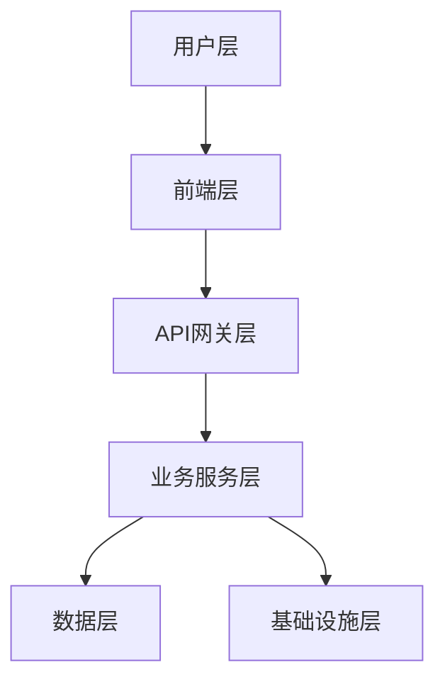
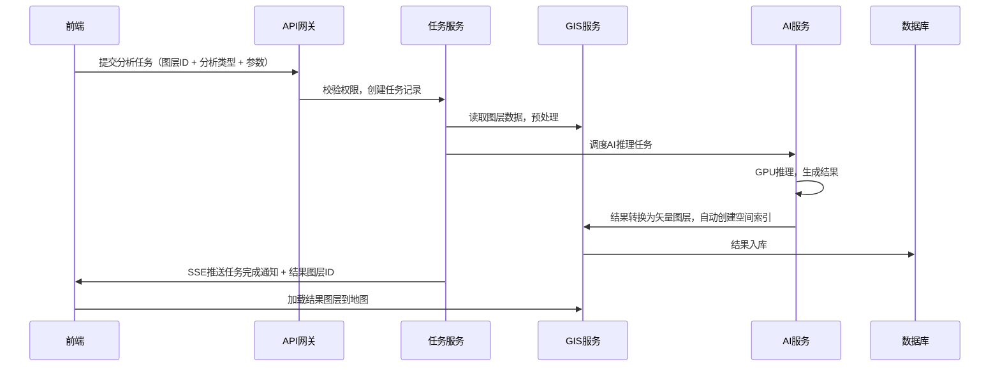
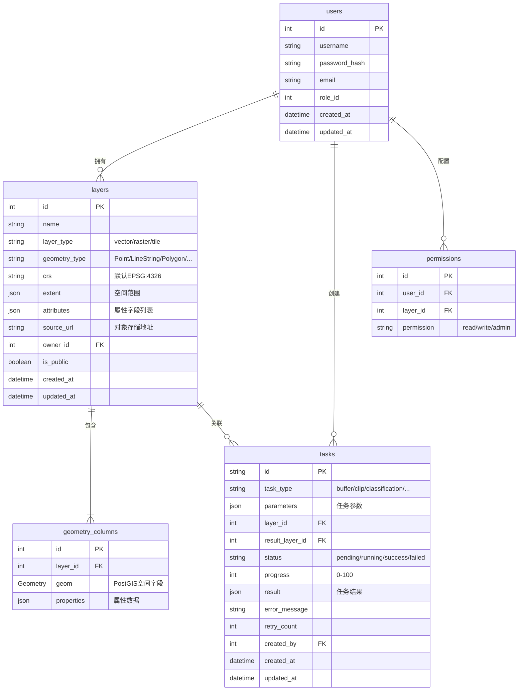

# WebGIS AI Agent 技术架构设计文档
> 版本：v1.0 | 日期：2026-03-25 | 状态：可落地执行

## 1. 架构概述
### 1.1 项目目标
打造集GIS空间分析、AI影像识别、任务编排于一体的智能地图分析平台，支持矢量/栅格数据管理、空间分析、AI遥感解译、工作流编排等核心能力。
### 1.2 设计原则
- **云原生优先**：全栈容器化、弹性扩缩容、微服务架构
- **GIS原生**：基于PostGIS、GeoPandas等成熟GIS生态，避免重复造轮子
- **AI友好**：支持大模型集成、GPU加速推理、任务异步编排
- **可扩展**：插件化设计，支持自定义算子、模型、组件扩展
- **性能优先**：空间索引、多级缓存、分布式计算，支持TB级空间数据处理

---
## 2. 整体分层架构设计

### 2.1 前端层（技术栈：Next.js 14 + TypeScript + MapLibre GL + Tailwind CSS）
| 模块 | 职责 | 技术选型 |
|------|-----|---------|
| 地图画布 | 矢量/栅格图层渲染、交互、标注 | MapLibre GL JS v5 + react-map-gl v8 |
| 组件库 | 通用UI组件 | shadcn/ui + Lucide Icons |
| 状态管理 | 全局状态管理 | Zustand |
| 数据请求 | API请求封装 | Axios + SWR |
| 部署 | 静态资源托管 | Vercel / Nginx / CDN |
### 2.2 API网关层（技术栈：FastAPI + Traefik）
| 模块 | 职责 | 技术选型 |
|------|-----|---------|
| 路由转发 | 请求路由、版本控制 | FastAPI 路由 + Traefik 反向代理 |
| 认证鉴权 | JWT认证、权限校验 | PyJWT + Casbin |
| 流量控制 | 限流、熔断、降级 | slowapi + Limiter |
| 日志监控 | 请求日志、链路追踪 | structlog + OpenTelemetry |
### 2.3 业务服务层（技术栈：Python 3.12 + FastAPI + Celery）
| 模块 | 职责 | 技术选型 |
|------|-----|---------|
| 图层管理服务 | 矢量/栅格数据上传、解析、存储、查询 | GeoPandas + Rasterio + pyogrio |
| 空间分析服务 | 缓冲区、叠加分析、网络分析等GIS算子 | PostGIS + GeoPandas + Dask（分布式） |
| AI分析服务 | 影像分类、变化检测、目标提取等AI能力 | PyTorch + Transformers + ONNX Runtime |
| 任务编排服务 | 异步任务调度、工作流编排、进度管理 | Celery + Redis + Flowable（复杂工作流） |
| 元数据服务 | 数据目录、权限管理、操作审计 | SQLAlchemy + PostgreSQL |
### 2.4 数据层（技术栈：PostgreSQL + PostGIS + MinIO + Redis）
| 存储类型 | 存储内容 | 技术选型 |
|---------|---------|---------|
| 关系型存储 | 用户、图层元数据、任务记录、权限配置 | PostgreSQL 16 + PostGIS 3.4 |
| 对象存储 | 矢量/栅格原始文件、分析结果、模型文件 | MinIO / 阿里云OSS |
| 缓存存储 | 热点查询结果、瓦片缓存、任务状态、会话 | Redis 7 |
| 消息队列 | 异步任务、事件通知 | Redis / Kafka |
### 2.5 基础设施层
| 资源 | 选型 |
|------|-----|
| 计算资源 | x86 CPU服务器 + NVIDIA GPU服务器（AI推理） |
| 操作系统 | Ubuntu 22.04 LTS |
| 容器编排 | Docker + Docker Compose（开发环境）/ Kubernetes（生产环境） |
| 监控体系 | Prometheus + Grafana + Loki |
| CI/CD | GitHub Actions / GitLab CI |

---
## 3. GIS地图服务与AI大模型能力集成方案
### 3.1 GIS服务栈
```
[数据上传] → [格式解析] → [坐标转换] → [空间索引] → [PostGIS入库] → [瓦片生成] → [前端渲染]
```
- **格式兼容**：支持所有主流GIS格式（GeoJSON/Shapefile/KML/GeoPackage/GeoTIFF/COG）
- **坐标系统一**：所有数据自动转换为EPSG:4326存储，前端按需投影
- **空间索引**：矢量图层自动创建GIST索引，栅格数据采用COG格式支持按需读取
### 3.2 AI推理栈
```
[任务提交] → [数据预处理] → [GPU推理] → [结果后处理] → [矢量生成] → [结果入库]
```
- **模型集成**：支持PyTorch/TensorFlow/ONNX格式模型，提供标准化模型封装接口
- **GPU加速**：AI任务调度到GPU Worker节点，模型预加载到显存，推理性能提升10-100倍
- **结果标准化**：AI识别结果自动转换为标准矢量图层，可直接在地图渲染、参与空间分析
### 3.3 集成数据流

### 3.4 Agent编排能力
- **算子插件化**：所有GIS/AI算子封装为标准化Agent，支持热插拔、版本管理
- **工作流编排**：支持可视化拖拽编排多步骤分析流程（例：影像上传→AI地物分类→缓冲区分析→统计导出）
- **自动容错**：任务失败自动重试，超时自动终止，异常自动告警
- **资源调度**：自动根据任务类型分配最优计算资源（CPU/GPU/分布式集群）

---
## 4. 核心接口规范
### 4.1 基础规范
- **版本控制**：所有接口前缀为`/api/v1`，后续迭代通过版本号隔离
- **请求格式**：`application/json`，文件上传使用`multipart/form-data`
- **响应格式**：统一响应体结构
```json
{
  "code": 0, // 0成功，非0失败
  "msg": "success", // 错误信息
  "data": {}, // 返回数据
  "request_id": "xxx" // 链路追踪ID
}
```
- **错误码规范**：
  | 错误码 | 含义 |
  |-------|-----|
  | 0 | 成功 |
  | 400 | 请求参数错误 |
  | 401 | 未授权 |
  | 403 | 无权限 |
  | 404 | 资源不存在 |
  | 500 | 服务器内部错误 |
### 4.2 核心接口列表
| 接口 | 方法 | 路径 | 描述 |
|------|-----|-----|-----|
| 图层上传 | POST | `/api/v1/layers/upload` | 上传GIS文件，自动解析入库 |
| 图层查询 | GET | `/api/v1/layers` | 分页查询图层列表，支持空间过滤 |
| 图层详情 | GET | `/api/v1/layers/{id}` | 获取图层元数据/空间数据 |
| 任务提交 | POST | `/api/v1/tasks` | 提交空间分析/AI识别任务 |
| 任务查询 | GET | `/api/v1/tasks/{id}` | 获取任务状态、进度、结果 |
| 任务进度 | GET | `/api/v1/tasks/{id}/sse` | SSE实时推送任务进度 |
| 空间查询 | POST | `/api/v1/layers/{id}/query` | 按bbox/空间条件查询图层数据 |
| 元数据查询 | GET | `/api/v1/meta/layer-types` | 获取支持的图层类型、分析算子列表 |

---
## 5. 数据库设计
### 5.1 核心表结构

### 5.2 PostGIS扩展配置
```sql
-- 启用PostGIS扩展
CREATE EXTENSION IF NOT EXISTS postgis;
CREATE EXTENSION IF NOT EXISTS postgis_topology;
CREATE EXTENSION IF NOT EXISTS postgis_raster;
-- 矢量图层空间索引（自动创建）
CREATE INDEX idx_layer_geom ON geometry_columns USING GIST(geom);
```

---
## 6. 容器化部署架构
### 6.1 开发环境部署（docker-compose）
```yaml
version: '3.8'
services:
  # 数据库
  postgis:
    image: postgis/postgis:16-3.4
    environment:
      POSTGRES_DB: webgis_ai
      POSTGRES_USER: postgres
      POSTGRES_PASSWORD: postgres
    volumes:
      - postgis_data:/var/lib/postgresql/data
    ports:
      - "5432:5432"
  # Redis
  redis:
    image: redis:7-alpine
    ports:
      - "6379:6379"
  # MinIO对象存储
  minio:
    image: minio/minio
    command: server /data --console-address ":9001"
    ports:
      - "9000:9000"
      - "9001:9001"
    volumes:
      - minio_data:/data
  # 后端API
  backend:
    build: ./backend
    ports:
      - "8000:8000"
    depends_on:
      - postgis
      - redis
      - minio
  # Celery Worker
  worker:
    build: ./backend
    command: celery -A app.core.celery_app worker --loglevel=info
    depends_on:
      - redis
  # 前端
  frontend:
    build: ./frontend
    ports:
      - "3000:3000"
volumes:
  postgis_data:
  minio_data:
```
### 6.2 生产环境部署（Kubernetes）
- **无状态服务**：前端、API网关、Celery Worker 部署为Deployment，水平扩缩容
- **有状态服务**：PostgreSQL、Redis、MinIO 部署为StatefulSet，使用持久化存储
- **GPU Worker**：AI推理任务调度到带GPU的节点，使用NVIDIA Device Plugin调度GPU资源
- **Ingress**：使用Traefik/Nginx Ingress统一对外暴露服务，配置HTTPS证书
### 6.3 CI/CD流程
```
[代码提交] → [自动构建镜像] → [单元测试] → [集成测试] → [扫描漏洞] → [开发环境部署] → [人工审核] → [生产环境灰度发布]
```

---
## 7. 非功能设计
### 7.1 性能指标
- 图层上传解析：100MB矢量文件<5分钟，1GB影像文件<15分钟
- 空间查询：千万级矢量数据空间查询<2s
- AI推理：1000x1000影像目标提取<1s（GPU）
- 任务调度：任务从提交到开始执行<1s
### 7.2 安全设计
- 认证：JWT token认证，有效期2小时，支持刷新
- 权限：RBAC权限模型，数据按用户隔离，支持共享权限
- 数据加密：静态存储加密，传输层强制HTTPS
- 审计：所有操作日志持久化，支持追溯
### 7.3 可观测性
- 日志：全链路日志采集，统一存储到Loki
- 监控：CPU/GPU/内存/磁盘/队列长度等核心指标采集到Prometheus，Grafana可视化
- 告警：任务失败、队列积压、资源不足等异常场景自动告警到邮件/飞书
