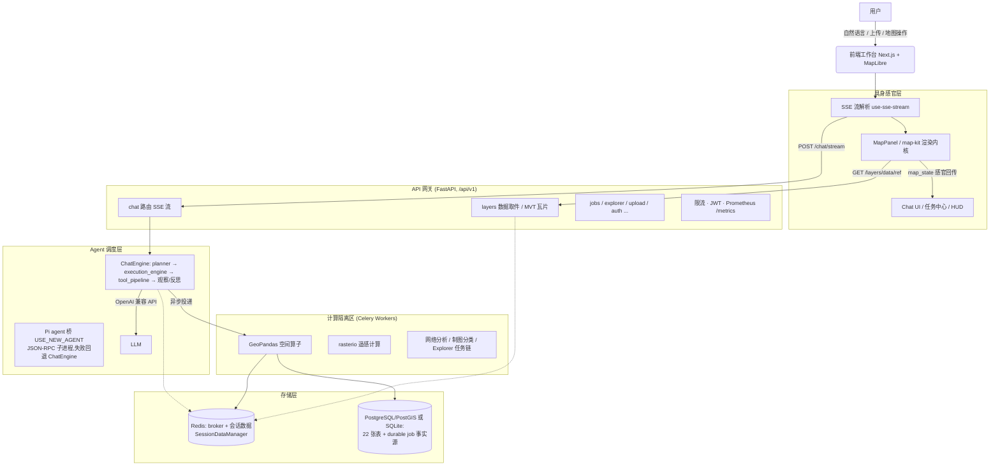

# WebGIS AI Agent 架构文档

系统分层架构、核心数据链路与扩展纪律。

> **版本**: v0.1.3 · **状态**: 活文档 · **最后更新**: 2026-08-17
>
> 配套阅读:[技术方案说明书](./技术方案说明书.md)(概念域与演进)、[API 文档](./api-docs.md)(接口契约)、[数据库设计](./database-design.md)(存储)。

## 目录

- [1. 设计原则](#1-设计原则)
- [2. 分层架构](#2-分层架构)
- [3. 核心链路](#3-核心链路)
- [4. 关键子系统](#4-关键子系统)
- [5. 稳定性机制](#5-稳定性机制)
- [6. 部署拓扑](#6-部署拓扑)
- [7. 扩展纪律](#7-扩展纪律)

## 1. 设计原则

本项目把 LLM Agent 当作系统的逻辑核心,而不是外挂插件。四条不变式贯穿全部代码:

1. **Agent 是唯一真理来源**:上传、地图操作等传统交互也必须通过感知-上报机制同步给 Agent;禁止绕过 Agent 的旁路端点。
2. **具身感知**:前端 MapLibre 实例是 Agent 的感官。每次聊天请求携带 `map_state`(视口、活跃图层),后端将其注入 LLM 上下文,使 Agent 的决策基于用户当前所见。
3. **计算隔离**:FastAPI 只做信号传输;GeoPandas 连接、rasterio 掩膜级别的重计算一律投递 Celery worker 执行,事件循环上不允许出现秒级阻塞。
4. **上下文只装逻辑,不装数据**:大尺寸计算结果通过 `ref:` 提货券流转(见 [Fetch-on-Demand](./data-fetcher.md)),LLM 只看到 `{"layer_id", "render_type"}` 级别的虚壳签名。

## 2. 分层架构

```mermaid
graph TD
    A[用户] -->|自然语言 / 上传 / 地图操作| B(前端工作台 Next.js + MapLibre)

    subgraph 前端 ["具身感官层"]
        B1[SSE 流解析 use-sse-stream] --> B2[MapPanel / map-kit 渲染内核]
        B2 -->|map_state 感官回传| B3[Chat UI / 任务中心 / HUD]
    end
    B --> B1

    subgraph 网关 ["API 网关 (FastAPI, /api/v1)"]
        C1[chat 路由 SSE 流]
        C2[layers 数据取件 / MVT 瓦片]
        C3[jobs / explorer / upload / auth ...]
        C4[限流 · JWT · Prometheus /metrics]
    end
    B1 -->|POST /chat/stream| C1
    B2 -->|GET /layers/data/ref| C2

    subgraph Agent ["Agent 调度层"]
        D[ChatEngine: planner → execution_engine → tool_pipeline → 观察/反思]
        D1[Pi agent 桥 USE_NEW_AGENT<br/>JSON-RPC 子进程,失败回退 ChatEngine]
        D -->|OpenAI 兼容 API| E[LLM]
    end
    C1 --> D

    subgraph 计算 ["计算隔离区 (Celery Workers)"]
        F[GeoPandas 空间算子]
        F1[rasterio 遥感计算]
        F2[网络分析 / 制图分类 / Explorer 任务链]
    end
    D -->|异步投递| F

    subgraph 存储 ["存储层"]
        G[(Redis: broker + 会话数据<br/>SessionDataManager)]
        H[(PostgreSQL/PostGIS 或 SQLite:<br/>22 张表 + durable job 事实源)]
    end
    D -.-> G
    F --> G
    F --> H
    C2 -.-> G
```

## 3. 核心链路

### 3.1 一次对话的完整生命周期

1. 前端采集 `map_state`(视口中心、zoom、图层显隐)随 `POST /api/v1/chat/stream` 上行。
2. `ChatEngine`(`app/services/chat/`)组装上下文:系统提示 + 会话历史 + 当前地图状态 + 项目上下文(`project_id`)。
3. **规划-执行循环**:planner 产出计划 → execution_engine 逐个调度工具 → 工具结果(含失败)作为观察回填 → LLM 反思决定下一步。`{"error": ...}` 的工具返回被统一识别为失败,计划不会跨过失败推进。
4. 工具产出的大结果挂载为 `ref:geojson-*` 提货券,SSE 只下发引用与渲染指令(20 个地图指令,如 `fly_to` / `add_layer` / `zoom_to_bbox`);前端 `map-action-handler` 分发渲染。
5. 全程 SSE 流式:思考 token、工具进度、结果卡片、心跳帧按序下发;消息按同步写入保证自增 ID 与时间轴一致。

### 3.2 Fetch-on-Demand 与 MVT(数据平面)

- 小数据(阈值以下)整包 GeoJSON 下发;`use-sse-stream.ts` 以 `VECTOR_TILE_THRESHOLD = 5000` 分流。
- 大数据:>5000 要素图层走 **MVT 矢量瓦片**(`/layers/{id}/tiles/{z}/{x}/{y}`,ETag/304 + single-flight),MapLibre `transformRequest` 注入会话凭据加载;要素级数据走 `ref:` 提货券按需拉取。
- 详见 [data-fetcher.md](./data-fetcher.md)。

### 3.3 统一 Durable Job 运行时(ADR-0052)

所有长任务(空间分析、Explorer 链、制图)进入同一 job 生命周期:状态落库(`analysis_tasks` 表,含 `job_kind` / `session_id` / `owner_token` / `heartbeat_at` / `attempt` 等列)、心跳续约、两段式取消(先落 `cancel_requested_at`,再触发进程内 token)、失败可幂等重试。前端任务中心经 `GET /api/v1/tasks/jobs` 统一查看 durable job 与内存态 agent task。跨重启后任务状态依然可查、可取消。

### 3.4 空间探索引擎 Explorer

六阶段流水线(`app/services/explorer/`):意图识别 → 数据发现 → 抓取 → 解析 → 验证 → 地理编码,以 Celery 任务链(`app/tasks/explorer/task_chain.py`)执行。进度经 `explorer_progress` 事件推送:登录会话走属主校验的独立流,匿名会话桥接进会话隔离的聊天流。任务有并发上限、可关闭、随会话切换清理,链运行状态跨重启持久。

### 3.5 制图闭环(MapSpec)

Agent 产出 MapSpec(制图规范)→ 后端分类(Fisher-Jenks,千样本上限)→ 前端 Canvas 合成(指北针随 bearing 旋转、比例尺按 `156543·cos(lat)/2^zoom` 动态计算、图例自动检测图层 metadata)→ PNG/PDF 落盘(A4 版式、300 DPI 重采样)→ 隐式系统消息回告 Agent 存储路径,形成"制图-交付-存档"闭环。质量分级见 [cartographic-closed-loop.md](./cartographic-closed-loop.md)。

## 4. 关键子系统

| 子系统 | 位置 | 职责 |
|---|---|---|
| ChatEngine | `app/services/chat/` | 规划-执行-反思循环、上下文组装、SSE 事件 |
| Pi agent 桥 | `app/agent_pi_bridge.py` | `USE_NEW_AGENT` 开启后以 JSON-RPC 子进程驱动 Pi agent,工具经 `/pi-tools/execute` 回调分发;初始化失败自动回退 ChatEngine |
| 工具注册中心 | `app/tools/registry.py` + `app/tools/__init__.py` | 34 组静态注册 + `app/skills/*.md` 动态技能;`ref:` 参数自动解引用 |
| Durable Jobs | `app/services/jobs/` | 统一任务运行时:提交/生命周期/取消/进度/产物 |
| Explorer | `app/services/explorer/` | 六阶段数据探索流水线 |
| Data Fabric | `app/services/data_fabric/` | 外部数据源目录、适配器、断路器、物化 |
| MapSpec | `app/services/mapspec/` + `frontend/lib/mapspec-compiler/` | 制图规范编译(服务端分类 + 前端 Canvas 合成) |
| RAG | `app/services/rag/` | 文档分块、sentence-transformers 嵌入、FAISS 检索 |
| 会话数据 | `app/services/session_data.py` | Redis 后端的提货券存取,每 session LRU 上限 200 条 |
| 任务队列 | `app/services/task_queue.py` | Celery app:acks_late、1h 硬超时、无 Redis 时 eager 兜底 |
| 中文地图源 | `app/tools/chinese_maps/` | 天地图 / 高德 / 百度协议适配 |

## 5. 稳定性机制

- **SSE 心跳**:工具阻塞期间事件驱动下发注释帧 `: keep-alive`;Explorer 看门狗每 15s 发 `heartbeat` 数据帧,防中间网关掐断长连接。
- **Exception-as-Thought**:工具异常不抛 500,而是打包为"失败原因 + 纠错建议(如调用 `fix_crs`)"的伪用户消息回流 LLM 反思重试。
- **所有权与隔离**:任务/上传/探索按 `session_id` + `owner_token` 作用域;匿名会话按 owner_token 分桶,消除跨用户驱逐。
- **限流**:登录接口与全局 API 限流(见 [rate-limiting.md](./rate-limiting.md))。
- **健康探针**:`/api/v1/health/live`(liveness)与 `/api/v1/ready`(readiness,DB+LLM+Redis+Celery)。

## 6. 部署拓扑

- **本地开发**:SQLite + 本地/容器 Redis,Celery eager 或本机 worker(`manage.py dev`)。
- **Docker Compose**:开发栈 4 服务(db/redis/api/celery);生产栈 10 服务(+nginx/Prometheus/Grafana/exporters);安全栈 9 服务(db/redis 不暴露端口,nginx 唯一公网入口)。详见 [DEPLOYMENT.md](./DEPLOYMENT.md)。
- **Kubernetes**(`deploy/k8s/`):initContainer 执行 `alembic upgrade head`,HPA 按 CPU/内存伸缩,PDB 保可用。
- **CI/CD**:PR 9 项门禁 → release-gate → 镜像推送 ghcr.io → PR 预览 / 生产部署 / 一键回滚。

## 7. 扩展纪律

新增空间算子、爬虫组件或工具时的红线(与 [CODE_REVIEW.md](../CODE_REVIEW.md) 一致):

1. **Pydantic Type Guard** — 工具入参用最严格的 `pydantic.Field` 约束,拒绝裸 dict。
2. **Zero Big Data in Context** — 禁止把 FeatureCollection 交给 LLM;一律挂 `ref:` 提货券。
3. **Celery First** — 凡用到 `gpd.sjoin` / `rasterio.open` / `pd.read_csv` 的路径必须投递 Celery,不得阻塞事件循环。
4. **No Raster Push** — 后端不生图片;交付源数据 + `metadata.color_ramp`,渲染交给前端 MapLibre。
5. **失败要诚实** — 工具失败必须以 `{"error": ...}` 显式返回并计入失败分类;禁止吞异常伪装成功。
6. **架构级变更先写 ADR** — `docs/adr/` 已有 54 篇决策记录,新决策先立字据再动代码。
