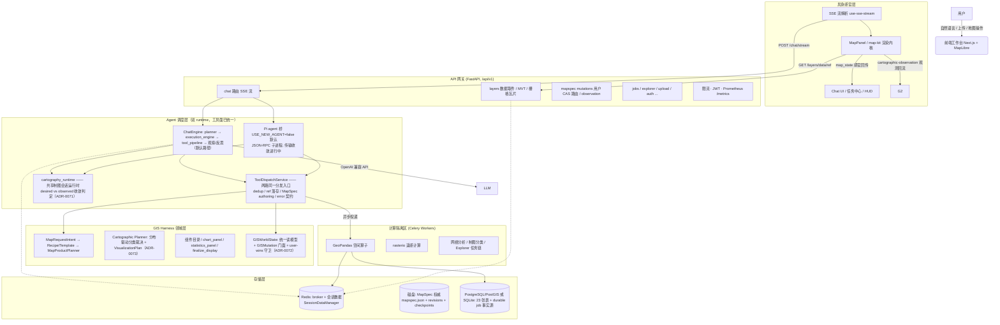

# WebGIS AI Agent 架构文档

系统分层架构、核心数据链路与扩展纪律。

> **版本**: v0.3.0 · **状态**: 活文档 · **最后更新**: 2026-08-29（GIS Harness Runtime v2,ADR-0079）
>
> 配套阅读:[技术方案说明书](./技术方案说明书.md)(概念域与演进)、[API 文档](./api-docs.md)(接口契约)、[数据库设计](./database-design.md)(存储)、[GIS Harness](./gis-harness.md)(harness 分层)。

## 目录

- [1. 设计原则](#1-设计原则)
- [2. 分层架构](#2-分层架构)
- [3. 核心链路](#3-核心链路)
- [4. 关键子系统](#4-关键子系统)
- [5. 稳定性机制](#5-稳定性机制)
- [6. 部署拓扑](#6-部署拓扑)
- [7. 扩展纪律](#7-扩展纪律)

## 1. 设计原则

本项目把 LLM Agent 当作系统的逻辑核心,而不是外挂插件。不变式贯穿全部代码:

1. **Agent 是唯一真理来源**:上传、地图操作等传统交互也必须通过感知-上报机制同步给 Agent;禁止绕过 Agent 的旁路端点。
2. **具身感知**:前端 MapLibre 实例是 Agent 的感官。每次聊天请求携带 `map_state`(视口、活跃图层),后端将其注入 LLM 上下文;观测回流(`cartographic-observation` 端点)携带 runtime 读回证据参与收敛判定。
3. **计算隔离**:FastAPI 只做信号传输;GeoPandas 连接、rasterio 掩膜级别的重计算一律投递 Celery worker 执行,事件循环上不允许出现秒级阻塞。
4. **上下文只装逻辑,不装数据**:大尺寸计算结果通过 `ref:` 提货券流转(见 [Fetch-on-Demand](./data-fetcher.md)),LLM 只看到 `{"layer_id", "render_type"}` 级别的虚壳签名。GISWorldState 快照、ref descriptor、RasterArtifactDescriptor 同样只携带有界元数据。
5. **User interaction wins**:用户的显式操作(显隐/透明度/组件摆放)是 durable 决策——前端有 `_userPinned`/CAS 豁免,服务端有 UserPresentationGuard(ADR-0072)强制拒绝 agent 反转;组件 CAS 的 superseded 语义天然让用户最新交互优先。
6. **失败要诚实**:工具失败以 `{"error": ...}` 显式返回;QA 检查区分 pass/fail/warning/not_evaluated——没有证据就报 not_evaluated,绝不假成功。

## 2. 分层架构


```mermaid
graph TD
    A[用户] -->|自然语言 / 上传 / 地图操作| B(前端工作台 Next.js + MapLibre)

    subgraph 前端 ["具身感官层"]
        B1[SSE 流解析 use-sse-stream] --> B2[MapPanel / map-kit 渲染内核]
        B2 -->|map_state 感官回传| B3[Chat UI / 任务中心 / HUD]
        B2 -->|cartographic-observation 观测回流| G2
    end
    B1 -->|POST /chat/stream| C1

    subgraph 网关 ["API 网关 (FastAPI, /api/v1)"]
        C1[chat 路由 SSE 流]
        C2[layers 数据取件 / MVT / 栅格瓦片]
        C5[mapspec mutations 用户 CAS 路由 / observation]
        C3[jobs / explorer / upload / auth ...]
        C4[限流 · JWT · Prometheus /metrics]
    end
    B2 -->|GET /layers/data/ref| C2

    subgraph Agent ["Agent 调度层（双 runtime，工具面已统一）"]
        D[ChatEngine: planner → execution_engine → tool_pipeline → 观察/反思<br/>（默认路径）]
        D1[Pi agent 桥 USE_NEW_AGENT=false 默认<br/>JSON-RPC 子进程; 传输收敛进行中]
        D2[ToolDispatchService —— 两路同一分发入口<br/>dedup / ref 落存 / MapSpec authoring / error 契约]
        CR[cartography_runtime —— 共享制图会话运行时<br/>desired vs observed 收敛判定（ADR-0071）]
    end
    C1 --> D
    C1 --> D1
    D --> D2
    D1 --> D2
    D --> CR
    D1 --> CR
    D -->|OpenAI 兼容 API| E[LLM]

    subgraph Harness ["GIS Harness 领域层"]
        H1[MapRequestIntent → Recipe/Template → MapProductPlanner]
        H2[Cartographic Planner: 分布驱动分类裁决 + VisualizationPlan（ADR-0073）]
        H3[组件目录 / chart_panel / statistics_panel / finalize_display]
        H4[GISWorldState: 统一读模型 + GISMutation 门面 + user-wins 守卫（ADR-0072）]
    end
    D2 --> H1
    D2 --> H4

    subgraph 计算 ["计算隔离区 (Celery Workers)"]
        F[GeoPandas 空间算子]
        F1[rasterio 遥感计算]
        F2[网络分析 / 制图分类 / Explorer 任务链]
    end
    D2 -->|异步投递| F

    subgraph 存储 ["存储层"]
        G[(Redis: broker + 会话数据<br/>SessionDataManager)]
        G1[(磁盘: MapSpec 权威<br/>mapspec.json + revisions + checkpoints)]
        H[(PostgreSQL/PostGIS 或 SQLite: 23 张表 + durable job 事实源)]
    end
    D -.-> G
    F --> G
    F --> H
    C2 -.-> G
```

## 3. 核心链路

### 3.1 一次对话的完整生命周期

1. 前端采集 `map_state`(视口中心、zoom、图层显隐)随 `POST /api/v1/chat/stream` 上行。
2. 路径裁决 `_use_pi_bridge()`(默认 ChatEngine;`USE_NEW_AGENT` 经 Settings 配置,默认 false)。
3. ChatEngine 组装上下文(系统提示 + 历史 token 预算 + 图层 inventory(descriptor 优先,零物化) + 项目上下文)→ 规划(LLM plan 或 `_synth_plan_from_harness` 确定性合成)→ LLM 循环(60 rounds / 900s 预算 / no-progress 熔断)。
4. 工具执行统一经 **ToolDispatchService**(ADR-0068):ref 解引用 → 执行(sync 工具 to_thread)→ 大结果挂 `ref:` → **MapSpec authoring**(产出即带 mapspec_fingerprint 证据)→ error 契约。
5. SSE 按序下发 token / tool_result / mapspec / mutation_revision;前端 session-cursor 收敛(单调 revision,旧代次事件拒收)。
6. 前端 `composeLiveMapSpec(committed, hud, pending, removed)` → MapSpecRuntime diff → MapLibre 增量应用。
7. **制图闭环**:reconcile 落定 → 观测采集(含 runtime 读回)→ POST observation(fingerprint+generation 双门)→ cartography_runtime 评估(desired vs observed)→ 修复(服务端 ≤2 轮 + 客户端总会话预算 8,ADR-0074)→ `finalize_display` 收口(服务端 durable patch + 前端 visibility 事务 + 证据 ack)。

### 3.2 Desired State 与 user-wins（ADR-0070/0072）

- **真相源**:后端 MapSpec(磁盘权威:mapspec.json + revisions 20 + checkpoints 20;Redis `map_state.mapspec` 为缓存,先盘后 cache)。`mutation_revision` 权威在 `map_state._cartographic_mutation_revision`。
- **用户路径**(`POST /chat/sessions/{sid}/mapspec/mutations`):`origin=user` 强制 CAS(`expected_revision`),superseded → 409 + 服务端真相回灌;前端所有 MapSpec 写共享一条串行链(一次 409 风暴根除)。
- **agent 路径**:map_product / layer_upsert 等无 CAS(last-writer-wins),但同 id upsert **保留用户 durable presentation**;`webgis_component_update` 可选 CAS(组件拖拽用户优先)。
- **UserPresentationGuard**:agent 反转用户最后显隐决策 → 服务端拒绝(诚实 error + correction_hint);同值幂等允许;finalize 上报 `user_hidden_respected`。
- **reload 恢复**:GET /map-state → committed spec 重建 → `presentationFromMapSpec` 终覆盖(用户/agent durable 决策存续);相机仅 `view.framed` 时恢复(ADR-0057)。

### 3.3 Fetch-on-Demand 与数据平面

- 小数据(阈值以下)整包 GeoJSON;`use-sse-stream.ts` 以 `VECTOR_TILE_THRESHOLD = 5000` 分流。
- 大数据:>5000 要素走 **MVT 矢量瓦片**(纯 Python 编码器、STRtree、ETag/304、single-flight、字节感知 LRU)。
- **栅格数据平面**(ADR-0075):RasterArtifactDescriptor(注册期 band/CRS/nodata/stats/overview 元数据)+ RasterStyleSpec(paint 侧样式:bands/stretch/colormap/opacity)。瓦片路径 cmap/bands 真实生效且进缓存键——**换样式只换缓存条目,绝不重跑遥感计算**。
- 详见 [data-fetcher.md](./data-fetcher.md)。

### 3.4 统一 Durable Job 运行时(ADR-0052)

所有长任务进入同一 job 生命周期:状态落库(`analysis_tasks`,含 `job_kind`/`session_id`/`owner_token`/`heartbeat_at`)、心跳续约、两段式取消、幂等重试;前端任务中心统一查看。

### 3.5 空间探索引擎 Explorer

六阶段流水线(意图识别 → 数据发现 → 抓取 → 解析 → 验证 → 地理编码),Celery 任务链执行,进度经 `explorer_progress` 事件推送。

### 3.6 制图闭环（MapSpec 生命周期 + QA）

```
MapRequestIntent ──► Recipe/Template 选择 ──► MapProductPlanner（确定性 + 证据）
   ──► Cartographic Planner：分布驱动分类裁决 + VisualizationPlan（ADR-0073）
   ──► 组件解析/装配（taxonomy→descriptor→variant→composition slots）
   ──► MapSpecLifecycleEngine（COW、分布式锁、CAS、事务 rollback）
   ──► QA：semantic_checks 规则 DSL（含 RESULT_VISIBILITY 意图检查、
         LAYOUT_COLLISION 布局检查）+ quality_loop AUTO_SAFE 修复（≤2 轮）
   ──► 前端渲染（mapspec-compiler + map-components registry，catalog parity）
   ──► 观测对照 → cartography_runtime 收敛判定 → finalize 收口
   ──► 项目记忆（shared_classification 指纹 + recipe_outcome，ADR-0069）
   ──► 导出（PNG/PDF/SVG；SVG 与 Python 双孪生 parity）
```

质量分级见 [cartographic-closed-loop.md](./cartographic-closed-loop.md)。

## 4. 关键子系统

| 子系统 | 位置 | 职责 |
|---|---|---|
| ChatEngine | `app/services/chat/` | 规划-执行-反思循环、上下文组装、SSE 事件（默认执行路径） |
| Pi agent 桥 | `app/agent_pi_bridge.py` | `USE_NEW_AGENT` 开启后以 JSON-RPC 子进程驱动 Pi;失败回退 ChatEngine;传输职责（收敛进行中，制图运行时已抽出） |
| cartography_runtime | `app/services/cartography_runtime.py` | **共享**制图会话运行时（ADR-0071）:harness 注册表、desired vs observed 评估、上下文水化、runtime repair |
| GISWorldState | `app/services/gis_world_state/` | 统一读模型快照、GISMutation 门面、provenance 决策链、user-wins 守卫（ADR-0072） |
| 工具注册中心 | `app/tools/registry.py` + `app/tools/` | 75 个 `@tool` 静态注册 + `app/skills/*.md` 动态技能;`ref:` 参数自动解引用 |
| ToolDispatchService | `app/services/tool_dispatch_service.py` | 两 runtime 共用的统一分发入口（ADR-0068）:dedup、ref 落存、MapSpec authoring、error 契约 |
| GIS Harness | `app/services/gis_harness/` + `app/lib/cartography/` | 意图→recipe→planner→组件装配的领域层;模型库/分类/色板/组合语法知识库 |
| Cartographic Planner | `app/lib/cartography/visualization_plan.py` | 分布驱动分类裁决、VisualizationPlan 一等工件（ADR-0073） |
| Durable Jobs | `app/services/jobs/` | 统一任务运行时:提交/生命周期/取消/进度/产物 |
| Explorer | `app/services/explorer/` | 六阶段数据探索流水线 |
| Data Fabric | `app/services/data_fabric/` | 外部数据源目录、适配器、断路器、物化 |
| MapSpec | `app/services/mapspec/` + `frontend/lib/mapspec-compiler/` | 制图规范生命周期（COW 引擎、CAS、checkpoint）+ 前端编译 |
| Raster 数据平面 | `app/schemas/raster_spec.py` + `raster_tile_service.py` | 工件描述子 + 样式契约;样式≠重算（ADR-0075） |
| 会话数据 | `app/services/session_data.py` | Redis/内存双后端提货券存取,LRU + 字节预算（增量记账） |
| RAG | `app/services/rag/` | 文档分块、sentence-transformers 嵌入、FAISS 检索 |
| 任务队列 | `app/services/task_queue.py` | Celery app:acks_late、1h 硬超时、无 Redis 时 eager 兜底 |

## 5. 稳定性机制

- **SSE 心跳**:工具阻塞期间事件驱动下发注释帧;Explorer 看门狗 15s 心跳。
- **Exception-as-Thought**:工具异常打包为"失败原因 + 纠错建议"的伪用户消息回流 LLM 反思重试。
- **SSE 断线续传**:有界重连(2 次)→ `Last-Event-ID` 只读 replay → 前端按 id 去重 + revision 单调收敛。
- **所有权与隔离**:任务/上传/探索按 `session_id` + `owner_token` 作用域;瓦片/ref 双通道鉴权。
- **观测-修复回路护栏**:服务端修复 ≤2 轮;客户端每会话总预算 8 次(耗尽停发观测修复,ADR-0074)。
- **限流 / 健康探针 / 分布式锁**(Lua token 释放/续期):同前。
- **GIS Harness Runtime v2**(ADR-0079,2026-08-29):
  - **原子状态不变量**:权威 MapSpec 载入先于 revision 捕获/CAS(磁盘复活
    路径回写令牌,杜绝 N→1 回退);spec+revision+指纹+runtime layers 单
    WATCH/MULTI 事务提交(`commit_mapspec_state`);回滚不回拨 CAS 令牌。
  - **锁纪律**:全部共享 Redis 写路径(SessionPlan/观察/ACK/delete/
    cartography 运行时/plan 执行)`fail_on_degraded=True` + 关键写前
    `lock.lost` 复检;锁降级/丢失映射结构化 503。
  - **GISMutationBatch**:`apply_presentation_batch` 把 N 个 presentation
    patch 合并为一个引擎事务(单锁/单读/单校验/revision 恰 +1);finalize
    的展示集与隐藏集同以 agent origin 服务端落盘(不再经 user 路由洗白)。
  - **Compiled Runtime Manifest**:启动编译全部 registry 为不可变快照 +
    分级校验(fatal fail-fast,`GIS_MANIFEST_STRICT=0` 逃生);O(1)
    tool↔capability 反查;内容指纹入 plan,恢复比对不一致 → STALE_PLAN。
  - **Layer Runtime**:custom-* 覆盖层挂载账本(setStyle 重挂);观察证据
    家族键联合匹配;label 子层上活地图;样式面板对 spec 层走
    `patch_layer_style` 持久通道(#1077)。
  - **ComponentLayoutRuntime**:槽位模型 + 确定性堆叠求解器(顶槽对称
    bottom U-2);FloatingChrome 键盘可达(方向键移动 + landmark 语义)。

## 6. 部署拓扑

- **本地开发**:SQLite + 本地/容器 Redis,Celery eager 或本机 worker(`manage.py dev`)。
- **Docker Compose**:开发栈 4 服务;生产栈 10 服务;安全栈 9 服务(nginx 唯一公网入口)。
- **Kubernetes**:initContainer `alembic upgrade head`,HPA/PDB。
- **CI/CD**:PR 9 项门禁 → release-gate → ghcr.io → 预览/生产/回滚;本地等价 gate:`scripts/ci-local.sh`(`--fast` 快速通道)。

## 7. 扩展纪律

新增空间算子、爬虫组件或工具时的红线(与 [CODE_REVIEW.md](../CODE_REVIEW.md) 一致):

1. **Pydantic Type Guard** — 工具入参用最严格的 `pydantic.Field` 约束,拒绝裸 dict。
2. **Zero Big Data in Context** — 禁止把 FeatureCollection/raster 二进制交给 LLM;一律挂 `ref:`;读模型(GISWorldState/descriptor)只装有界元数据。
3. **Celery First** — `gpd.sjoin` / `rasterio.open` / `pd.read_csv` 路径必须投递 Celery 或 to_thread,不得阻塞事件循环。
4. **MapSpec 是唯一 desired state** — 直接操作 MapLibre 或 Zustand 而不更新 desired state 的旁路禁止;新 mutation 经 `apply_gis_mutation` 门面(记录 provenance)。
5. **失败要诚实** — `{"error": ...}` 显式返回;QA 无证据报 not_evaluated。
6. **样式 ≠ 数据** — 栅格样式改动必须走 RasterStyleSpec(换缓存键),不得触发重计算。
7. **架构级变更先写 ADR** — `docs/adr/` 已有 75 篇决策记录,新决策先立字据再动代码。
