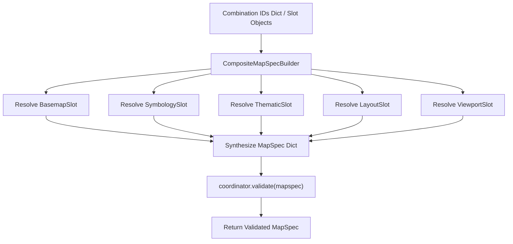

# Orthogonal Map Component Schema & Assembly Seam Design

> **Issue Reference**: #238  
> **Author**: WebGIS AI Agent Research Team  
> **Date**: 2026-08-02  

## 1. Context & Motivation

In previous iterations, cartographic themes were coupled monolithically to single template IDs. This limited flexibility when users wanted to combine a specific basemap (e.g. Carto Dark) with custom thematic classification (e.g. Jenks natural breaks) and a specific paper layout (e.g. A4 Academic).

Ticket #238 introduces **Orthogonal Theme Separation**, decomposing map themes into 5 independent component slots:
1. `BasemapSlot`
2. `SymbologySlot`
3. `ThematicSlot`
4. `LayoutSlot`
5. `ViewportSlot`

`CompositeMapSpecBuilder` acts as the assembly seam, taking any valid combination of slot specifications and compiling them into a unified, pre-compile validated `MapSpec`.

## 2. Component Slot Definitions

### 2.1 BasemapSlot
Configures the base cartographic provider, vector style endpoints, raster filter adjustments (grayscale, contrast, brightness), and base overlays.

### 2.2 SymbologySlot
Defines vector style properties (color, opacity, stroke, radius, line dash) for point, line, and polygon feature geometries in single or categorical mode.

### 2.3 ThematicSlot
Defines data classification parameters (Quantiles, Jenks Natural Breaks, Equal Interval, LISA) and color palette schemes for choropleth maps and density heatmaps.

### 2.4 LayoutSlot
Controls print & export layout (A4, 16:9), orientation, title/legend/north arrow/scale bar visibility, margins, font family, and accent colors.

### 2.5 ViewportSlot
Defines camera view extent: center coordinates `[lng, lat]`, zoom level, pitch, bearing, and bounding box.

## 3. Assembly Seam Flow

## 4. Integration Plan

1. **MapSpec Lifecycle Engine**: `CompositeMapSpecBuilder` results feed directly into `MapSpecLifecycleEngine.apply_mutation()` via a new or existing intent.
2. **Tool Registry**: FC tools `apply_composite_theme` can accept a slot combination dict and assemble a target MapSpec in a single atomic step.
