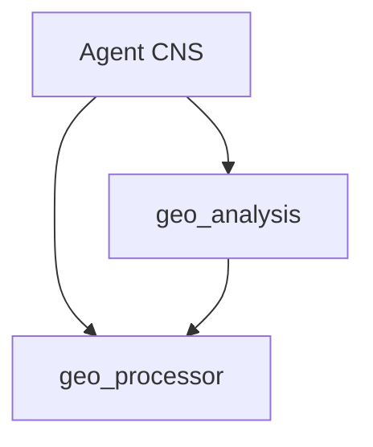

# Design Spec: Dual GIS Libraries (geo_processor & geo_analysis)

**Date:** 2026-05-17  
**Status:** Approved  
**Topic:** Architectural separation of spatial data transformation from spatial pattern analysis.

## 1. Goal
Decouple the existing monolithic geoprocessing logic into two professional-grade, independent libraries. `geo_processor` serves as the foundational geometric engine, while `geo_analysis` provides advanced spatial intelligence and LLM-friendly insights.

## 2. Architecture
The libraries will live in `app/lib/` as separate packages.

### 2.1 geo_processor (Foundational Engine)
- **Responsibility:** Geometric manipulation, topological operations, and coordinate system management.
- **Key Modules:**
  - `core.py`: CRS management, auto-UTM projection, GeoDataFrame/GeoJSON safety parsing.
  - `geometry.py`: Buffer, Clip, Dissolve, Simplify, Explode.
  - `overlay.py`: Intersection, Union, Difference, Identity, Symmetric Difference.
- **Design Principle:** "Geometry-First". Input is raw data, output is strictly validated spatial data.

### 2.2 geo_analysis (Intelligence Layer)
- **Responsibility:** Discovery of spatial relationships, statistical modeling, and narrative generation.
- **Key Modules:**
  - `statistics.py`: Moran's I, Getis-Ord Gi*, Standard Deviational Ellipse (SDE), Clustering.
  - `aggregation.py`: Spatial Aggregate (Point-in-Polygon), Grid/Fishnet generation (Square/Hex), Binning.
  - `network.py`: Network construction, Isochrones (Service Area), Nearest Neighbor (Network Distance).
- **Design Principle:** "Insight-First". Uses `geo_processor` for pre-processing; returns `GeoAnalysisResult` containing both data and textual summaries.

## 3. Dependency Graph

## 4. LLM Integration Patterns
- **Output Slimming:** All tools in `geo_analysis` must return a `summary` field.
- **Self-Healing:** Registry hooks will intercept common GIS errors from `geo_processor` and provide corrective hints.
- **Reference Flow:** Both libraries support `ref:xxx` cursors to maintain context without data bloat.

## 5. Success Criteria
- [ ] `geo_processor` can be imported and used without `geo_analysis`.
- [ ] `geo_analysis` provides automated narrative insights for at least 5 complex algorithms.
- [ ] 100% test coverage for core geometric operations in the new split structure.
